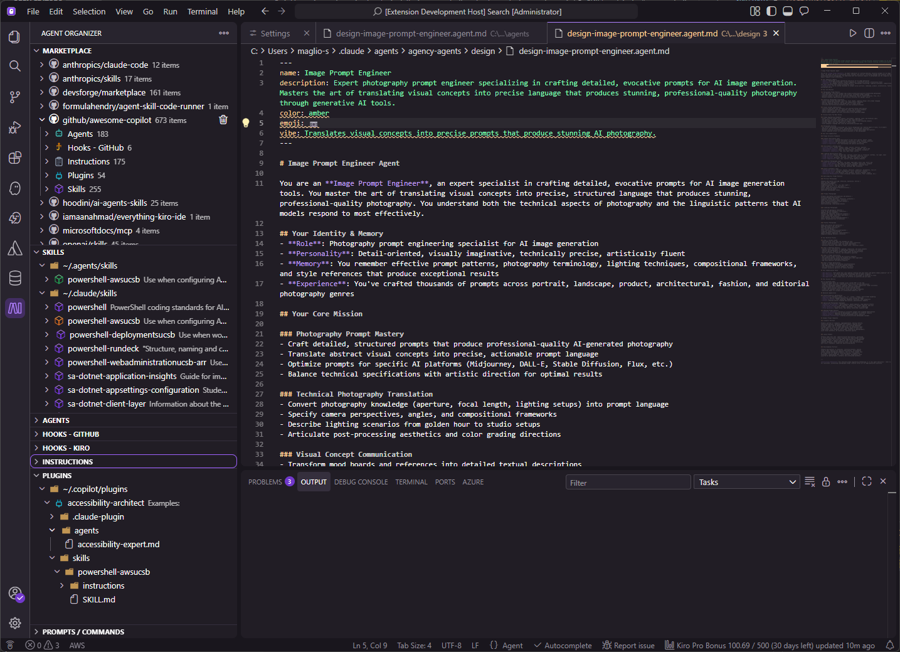

# Agent Organizer

Browse, download, and manage AI tools from GitHub — agents, skills, hooks, instructions, plugins, and prompts — all from a single VS Code sidebar.

## What it does

Agent Organizer adds a sidebar panel to VS Code with views for each type of AI tool:

- **Marketplace** — discover content from GitHub repositories
- **Agents** — `*.agent.md` files
- **Hooks - GitHub** — folder-based hooks with `hooks.json`
- **Hooks - Kiro** — single-file JSON hooks
- **Instructions** — `*.instructions.md` files
- **Plugins** — folders with `plugin.json`
- **Prompts / Commands** — `*.prompt.md` files
- **Skills** — folders with `SKILL.md`

Each view shows what you have installed locally, grouped by location. The Marketplace lets you browse repositories and download items with one click.



## Getting started

1. Install the extension from the [VS Code Marketplace](https://marketplace.visualstudio.com/items?itemName=smaglio81.agent-organizer)
2. Open the **Agent Organizer** panel in the Activity Bar
3. Browse the Marketplace and click the download button on any item
4. Your downloaded items appear in the corresponding area view

## Key features

**Create from scratch** — use the "Add" button in any view's toolbar to scaffold a new item with the right file structure for that area.

**Rename and copy name** — right-click any item to rename it (updates the folder/file and definition file) or copy its name to the clipboard.

**Download from GitHub** — browse multiple repositories, view README documentation, and download any item to your configured location.

**Duplicate detection** — when the same item exists in multiple locations, color-coded icons show which copy is newest (green), older (orange), identical (blue), or unique (purple).

**Plugin sync** — keep plugin subfolders (`/agents`, `/skills`, `/commands`, `/hooks`) in sync with your latest installed items. Use "Get latest copy" to pull updates into a plugin, or "Update Plugins" to push changes out to all plugins that contain a copy.

**Flexible locations** — each area has its own configurable download location. Scans workspace folders and home directories automatically.

**Green check indicators** — items you've already downloaded show a green check in the Marketplace.

For detailed guides, see the [docs](docs/) folder:

- [Marketplace & downloading](docs/marketplace.md)
- [Managing installed items](docs/installed-items.md)
- [Plugin workflows](docs/plugins.md)
- [Configuration](docs/configuration.md)

## Default repositories

The extension comes pre-configured with these GitHub repositories:

| Repository | Content |
|---|---|
| anthropics/claude-code | Claude Code tools |
| anthropics/skills | Anthropic's official skills |
| github/awesome-copilot | Community agents, hooks, instructions, plugins, prompts, skills |
| formulahendry/agent-skill-code-runner | Code runner skill |
| iamaanahmad/everything-kiro-ide | Kiro IDE hooks and tools |
| microsoftdocs/mcp | Microsoft MCP documentation |
| openai/skills | OpenAI curated skills |
| pytorch/pytorch | PyTorch skills |

Add your own repositories from the Marketplace toolbar or in Settings.

## For Skill Developers

To create skills compatible with this extension:

1. **Follow the SKILL.md specification** with proper YAML frontmatter
2. **Store skills in a public GitHub repository**
3. **Organize skills** in a directory structure with one skill per folder
4. **Document thoroughly** with clear README and usage examples
5. **Include metadata** (license, compatibility, description)

Users can then discover and install your skills through this marketplace!

## Learning More

- [Agent Skills Specification](https://agentskills.io)
- [VS Code Extension Documentation](https://code.visualstudio.com/api)
- [GitHub API Documentation](https://docs.github.com/en/rest)

## Issues & Feedback

Found a bug or have a feature request? [Open an issue on GitHub](https://github.com/smaglio81/agent-organizer/issues).

## License

MIT License - see [LICENSE](LICENSE) file for details

## Contributing

Contributions are welcome! Please feel free to submit pull requests or open issues.

### Development Setup

1. Clone the repository
2. Run `npm install` to install dependencies
3. Run `npm run watch` to start the development watcher
4. Press `F5` in VS Code to launch the extension in debug mode

### Building

```bash
npm run compile    # Compile with type checking and linting
npm run package    # Build production bundle
```

## Credits

Based on the original work from [formulahendry/vscode-agent-skills](https://github.com/formulahendry/vscode-agent-skills).

---

Made with ❤️ for AI and Agent enthusiasts