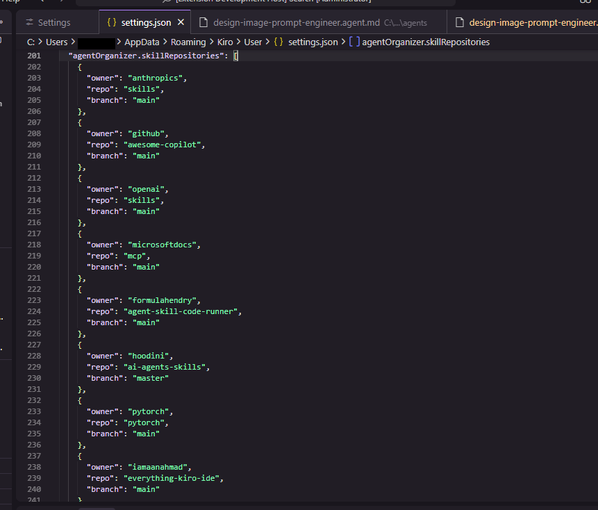
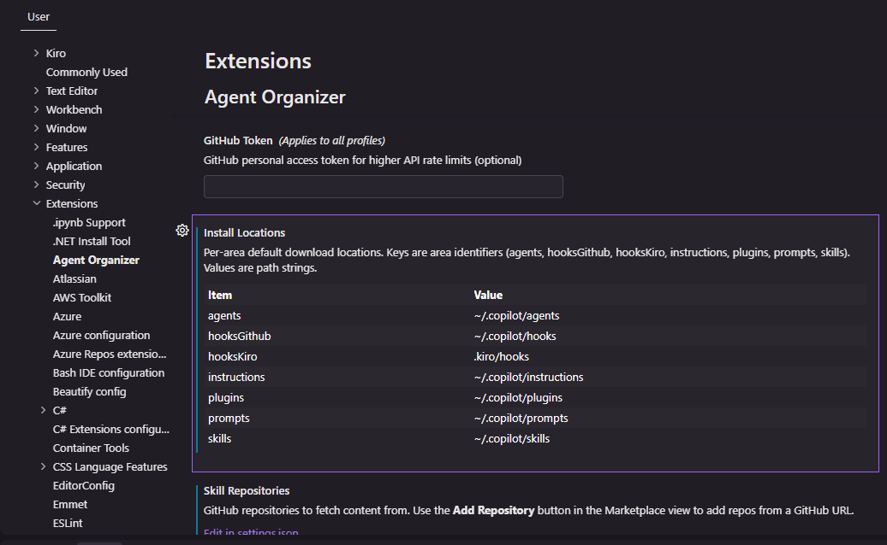

# Configuration

Open VS Code Settings (`Ctrl+,` / `Cmd+,`) and search for "Agent Organizer".

## Repositories

**Setting**: `agentOrganizer.skillRepositories`

An array of GitHub repositories to browse in the Marketplace. Each entry has `owner`, `repo`, and `branch` fields. You can edit these directly in the Settings UI or add repositories using the **+** button in the Marketplace toolbar.

## Download locations

**Setting**: `agentOrganizer.installLocations`

An object with a download path for each content area. Defaults to `~/.copilot/{area}` for each area. Hooks - Kiro is fixed to `.kiro/hooks`.

You can also change the download location from each view's toolbar using the folder icon button. Selecting "Custom..." opens the Settings UI.

### How locations are scanned

Each area view checks its own `chat.*` setting for scan locations. If that setting has values, those are used. Otherwise, a default list is generated from template prefixes.

| Area | Setting checked |
|---|---|
| Agents | `chat.agentFilesLocations` |
| Hooks - GitHub | `chat.hookFilesLocations` |
| Hooks - Kiro | Fixed to `.kiro/hooks` |
| Instructions | `chat.instructionsFilesLocations` |
| Plugins | `chat.pluginLocations` |
| Prompts / Commands | `chat.promptFilesLocations` |
| Skills | `chat.agentSkillsLocations` |

When the setting isn't configured, these default locations are scanned:

| Scope | Locations |
|---|---|
| Workspace | `.agents/{area}`, `.claude/{area}`, `.github/{area}`, `.kiro/{area}` |
| Home | `~/.agents/{area}`, `~/.claude/{area}`, `~/.copilot/{area}`, `~/.kiro/{area}` |

The configured download location from `agentOrganizer.installLocations` is also always included in the scan.

## GitHub token

**Setting**: `agentOrganizer.githubToken`

Optional. Provides higher GitHub API rate limits when browsing many repositories. Create a token at [GitHub Settings](https://github.com/settings/tokens) with `public_repo` scope.

## Cache timeout

**Setting**: `agentOrganizer.cacheTimeout`

How long (in seconds) to cache marketplace data. Default: 3600 (1 hour). Click Refresh in the Marketplace toolbar to bypass the cache.
