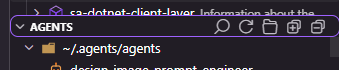
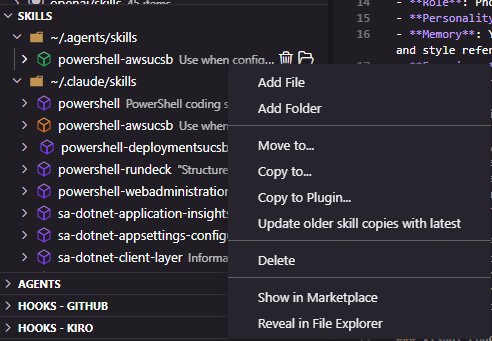

# Managing Installed Items

Each content area has its own view showing items installed on your machine.

## Views

All area views (Skills, Agents, Hooks, Instructions, Plugins, Prompts / Commands) share the same set of features:

- Duplicate detection with color-coded icons
- Sync/get-latest for duplicates
- Collapse/expand state persistence
- Search, refresh, default download location, expand all toolbar buttons
- Move to / Copy to between locations
- Copy to Plugin (except Plugins view)
- Show in Marketplace
- File watchers with debounced refresh

## Toolbar buttons

Every area view has these toolbar buttons:

| Button | What it does |
|---|---|
| Search | Filter items by name or description |
| Refresh | Re-scan all locations for changes |
| Default Download Location | Choose where new downloads go |
| Expand All | Expand all location groups |
| Collapse All | Collapse all location groups |

## Duplicate detection

When the same item name appears in multiple locations, icons change color:

| Color | Meaning |
|---|---|
| Purple | Unique — only one copy exists |
| Green | Newest — this copy has the latest changes |
| Orange | Older — a newer copy exists elsewhere |
| Blue | Same — all copies are identical |

Editing a file automatically triggers re-comparison. File watchers cover both workspace and home directory locations.

## Right-click options

| Action | Available on | What it does |
|---|---|---|
| Move to... | Items and location folders | Moves the item to a different location via a quick pick selector |
| Copy to... | Items and location folders | Copies the item to a different location, keeping the original |
| Copy to Plugin... | Items (not in Plugins or Instructions views) | Copies the item into a selected plugin's area subfolder |
| Update Plugins | Items (not in Plugins or Instructions views) | Updates all plugins that contain a copy of this item in their area subfolder |
| Update older copies with latest | Newest (green) items only | Overwrites all other copies of this item with this version |
| Get latest copy | Older (orange) items only | Replaces this copy with the newest version from another location |
| Show in Marketplace | Items | Reveals and highlights the matching item in the Marketplace tree |
| Reveal in File Explorer | Everything | Opens the item's location in the system file explorer |
| Delete | Items, files, folders | Removes the item (moved to trash) |
| Add File | Multi-file items and subfolders | Creates a new empty file and opens it in the editor |
| Add Folder | Multi-file items and subfolders | Creates a new subfolder |
| Rename | Files inside items | Renames the file |
