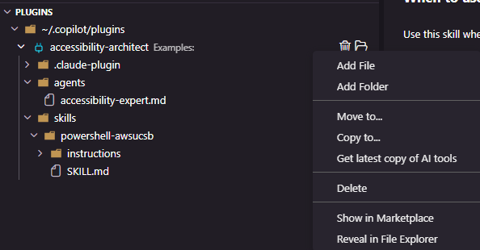

# Plugin Workflows

Plugins can contain subfolders that mirror other content areas:

| Plugin subfolder | Content area |
|---|---|
| `/agents` | Agents |
| `/skills` | Skills |
| `/commands` | Prompts / Commands |
| `/hooks` | Hooks - GitHub |

Agent Organizer provides tools to keep these subfolders in sync with your installed items.

## Copying items into a plugin

From any area view (Agents, Skills, Prompts / Commands, Hooks - GitHub), right-click an installed item and choose **Copy to Plugin...**. You'll be prompted to select which plugin to copy into. The area subfolder is created automatically if it doesn't exist.

## Updating plugins after making changes

If you've edited an item that's already been copied into one or more plugins, right-click it and choose **Update Plugins**. This searches through all your installed plugins and updates any that contain a copy of that item. A notification tells you how many plugins were updated — click **Show Details** for the full breakdown.

## Syncing a plugin with latest items

In the Plugins view, right-click options let you pull the latest versions of items from your installed areas into the plugin:

| Right-click on | Action | What it does |
|---|---|---|
| Plugin item | Get latest copy of AI tools | Updates all area subfolders at once |
| Area subfolder (e.g. `skills/`) | Get latest copies | Updates all items in that subfolder |
| Individual item | Get latest copy | Updates just that one item |

After syncing, a notification shows how many items were updated. Click **Show Details** to see per-item results in the output channel, including reasons for any skipped items.

## Copying items out of a plugin

Right-click any file or folder inside a plugin's area subfolder and choose **Copy to area**. The item is copied to the corresponding area's default download location.

## View Details

Clicking a plugin in the Marketplace opens a detail panel with three tabs:
- **README** — rendered markdown from the plugin's README.md
- **Raw Source** — the raw README content
- **plugin.json** — the raw definition file
